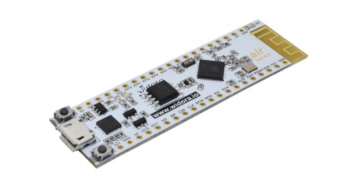

# micropython-intro

Primeros pasos y ejemplos de MicroPython en ESP32

## Introducción

En este respositorio se encuentran los tutoriales y ejemplos para comenzar a utilizar MicroPython en una placa ESP32. 

Para los ejemplos presentados aquí se utilizará una placa [Widora Air V4.0 ESP](https://www.esploradores.com/wp-content/uploads/2016/12/widora-air-sch.pdf) . A continuación se muestra una foto de dicha placa.

 

Si dispone de una placa diferente, se recomienda buscar el datasheet de la misma y corroborar que los pines utilizados estén disponibles en dicha placa. El pinout puede variar entre varios fabricantes de placas compatibles con ESP32.

## Secciones

1. [Instalación del Firmware MicroPython en la placa.|](1-Introduccion.md) 
2. Carga y ejecución de programas. GPIOs y Blinky.
3. Interrupciones.
4. Convertidor Analógico a Digital (ADC).
5. Conectarse a una red WiFi.
6. Punto de Acceso WiFi.